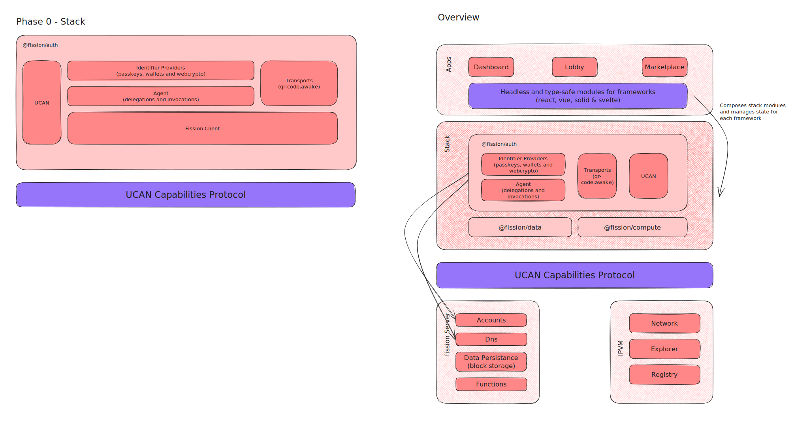

# API Design <!-- omit from toc -->

Table of Contents

- [Overview](#overview)
- [@fission/auth](#fissionauth)
  - [API](#api)
  - [Notes](#notes)
- [Identifier Providers](#identifier-providers)
  - [Features](#features)
- [Fission Client](#fission-client)
- [Agent](#agent)
- [Ucan Protocol](#ucan-protocol)

## Overview



## @fission/auth

### API

```ts
export type AuthResponse<R> =
  | {
      error: undefined
      result: R
    }
  | {
      error: Error
      result: undefined
    }

interface RegisterCredentials {
  username: string
  email: string
  options: {
    emailRedirectUrl?: string
  }
}
interface Credentials {
  username: string
}

interface Account {
  did: string
  username: string
  email: string
}

interface Session {
  agent: Agent
  account: Account
  expiresAt: number
  identifierDelegation: Ucan
  accountDelegation: Ucan
}

interface AuthConfig {
  name?: string // defaults to origin
  debug?: boolean
  identifier: IdentifierProvider
  agent: Agent // Handles signatures, dids, ucans and storage
  client: FissionClient // Handles server requests should be a generic client for a Auth UCAN Protocol
}

declare class Auth {
  constructor(config: AuthConfig)
}

interface IAuth {
  new (config: AuthConfig): Auth
  /**
   * Trigger an email flow to register a user
   * Signs a Register UCAN with an Identifier
   */
  register(credentials: RegisterCredentials): Promise<
    AuthResponse<{
      account: Account
    }>
  >

  /**
   * Used to exchange a code from an email link for a session
   */
  exchangeCodeForSession(code: string): Promise<
    AuthResponse<{
      session: Session
      account: Account
    }>
  >

  /**
   * Requests an Identifier Delegation and IF NEEDED Server Delegations
   *
   * Should we control Session TTL with Identifier Delegation exp and/or Server Delegation exp?
   */
  login(credentials: Credentials): Promise<
    AuthResponse<{
      session: Session
      account: Account
    }>
  >

  /**
   * Delete Identifier and server Delegations
   *
   * Should we delete all agent data as well?
   */
  logout(session: Session): Promise<void>

  /**
   * Subscribe to auth state changes
   */
  onStateChange(
    cb: (
      state: 'Login' | 'Logout' | 'Register' | 'Expired',
      session: null | Session
    ) => void
  ): UnsubscribeFn
}
```

### Notes

- Should keep tabs in sync when in browser

## Identifier Providers

We should support:

- local webcrypto with device link
- Passkeys synced and local (with device link?)
- Metamask Ucan Snap

### Features

- Providers SHOULD receive a set of capabilities and return a powerbox style UCAN with those capabilities.
- Providers with local capabilities SHOULD handle device link
- Providers SHOULD only depend on DID, Signatures and UCANs NOT on Agent or Storage. They can have other dependencies but they should be environment specific.

## Fission Client

Client SHOULD only handle HTTP logic, it should receive UCAN delegations, set bearer tokens according to [Spec](https://github.com/ucan-wg/ucan-http-bearer-token) and handle HTTP requests.

In the future this SHOULD be a generic UCAN-RPC client that can be used for any UCAN-RPC protocol, given a Capabilities Protocol.

## Agent

## Ucan Protocol
