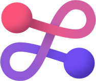

<div align="center">
  </img>

  <h1 align="center">Fission Stack</h1>

[](https://fission.codes)
[](https://discord.gg/zAQBDEq)
[>)](https://talk.fission.codes)

</div>

Monorepo for the Fission stack.

## Packages

- [eslint-config](https://github.com/fission-codes/stack/tree/main/packages/eslint-config) - Fission eslint, ts and prettier config.

## Examples

- [`demo`](https://github.com/fission-codes/stack/tree/main/examples/demo) - description

### Checkout examples

You can use [Codesandbox](https://githubbox.com/fission-codes/stack/tree/main/examples/demo) and start hacking right away.

To clone it locally:

```bash
npx tiged fission-codes/stack/examples/demo demo
cd demo
pnpm install
pnpm dev
```

You can try any of the examples by replacing `demo` with the name of the example you want to try.

## Contributing

Read contributing guidelines [here](.github/CONTRIBUTING.md).

[](https://codespaces.new/fission-codes/stack)

## License

This project is licensed under either of

- Apache License, Version 2.0, ([LICENSE-APACHE](./LICENSE-APACHE) or
  [http://www.apache.org/licenses/LICENSE-2.0][apache])
- MIT license ([LICENSE-MIT](./LICENSE-MIT) or
  [http://opensource.org/licenses/MIT][mit])

at your option.

### Contribution

Unless you explicitly state otherwise, any contribution intentionally
submitted for inclusion in the work by you, as defined in the Apache-2.0
license, shall be dual licensed as above, without any additional terms or
conditions.

[apache]: https://www.apache.org/licenses/LICENSE-2.0
[mit]: http://opensource.org/licenses/MIT
